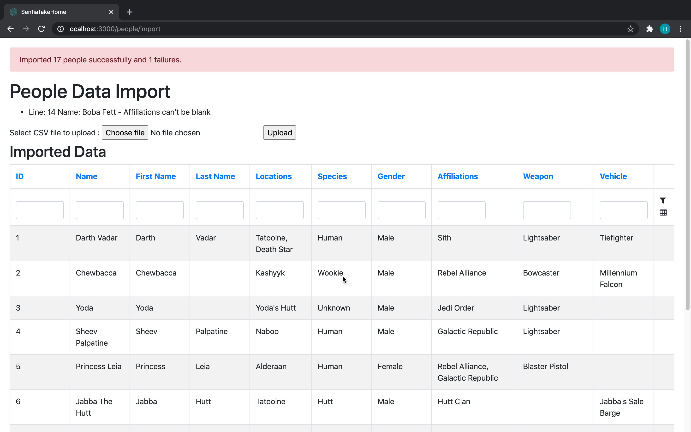
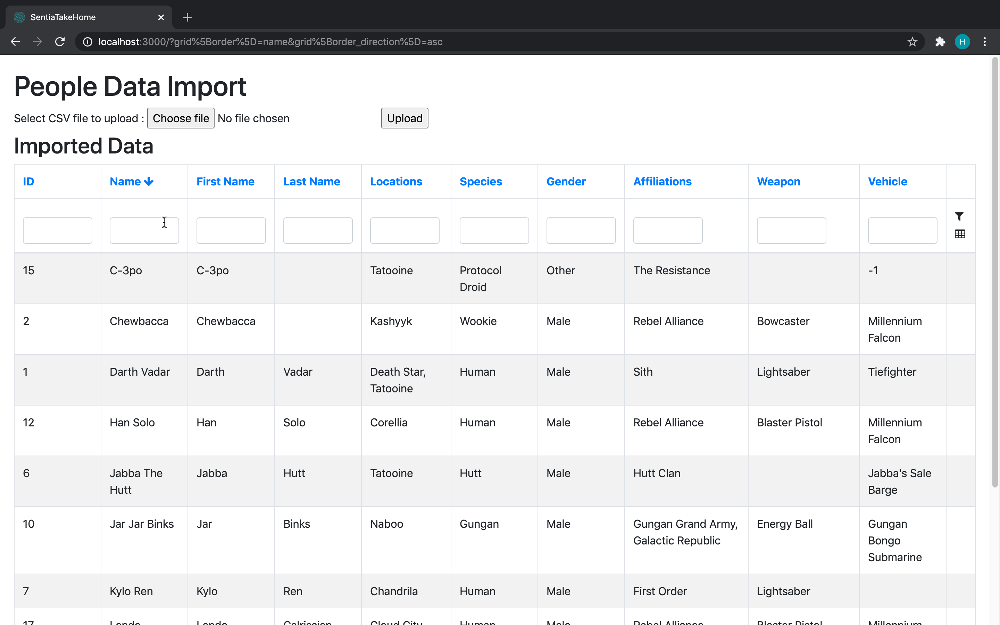

# Import Data from CSV and show in a grid

## Requirements

The application implements following requirements

### PART 1

1. As a user, I should be able to upload this sample CSV and import the data into a database.
IMPORTER REQUIREMENTS
a. The data needs to load into 3 tables. People, Locations and Affiliations
b. A Person can belong to many Locations
c. A Person can belong to many Affiliations
d. A Person without an Affiliation should be skipped
e. A Person should have both a first_name and last_name. All fields need to be validated except for last_name, weapon and vehiclewhich are optional.
f. Names and Locations should all be titlecased

### PART 2

1. As a user, I should be able to view these results from the importer in a table.
2. As a user, I should be able to paginate through the results so that I can see a maximum of 10 results at a time.
3. As a user, I want to type in a search box so that I can filter the results I want to see.
4. As a user, I want to be able to click on a table column heading to reorder the visible results.


## The code is tested on: 
  
  - Ruby version: ruby 2.6.3p62 (2019-04-16 revision 67580) [x86_64-darwin18]
  - Rails version: Rails 5.2.4.1


## System dependencies
  
  - Ruby
  - Ruby on Rails
  - PostgreSQL database


## Deployment instructions
  
  - Install dependencies
  ```
  bundle install
  ```
  - Create database tables
  ```
  rails db:setup to 
  ```
  - Run application
  ```
  rails s
  ```

## Sample Data
[Sample data for test](./TestData.csv)

## Screen Prints
1. Initial Screen
   
2. Data file selected
   
3. Data file uploaded
   
4. Show uploaded data in Grid with pagin at bottom
   
5. Sort data in grid based on column
   
6. Filter data in grid based on a column
   
7. Filter data in grid based on multiple columns
   
